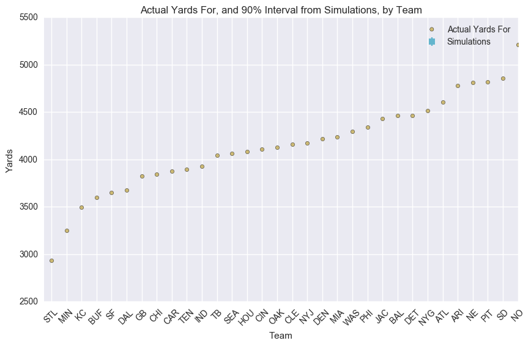

#+SETUPFILE: ~/bin/git/org-minimal-html-theme/setup/theme-minimal.setup
* Motivation
Given the results in football_autocorrelation.org, it seems that autocorrelation
isn't a significant factor for the passing yards data set. This is counter to my
own intuition but the data is what the data is. 

There however /should/ be some advantages to including auto-correlation in the
model. So, here, I'll compare a model that does and one that doesn't consider
autocorrelation. The models will be compared using cross-validation.

I'll build an initial model using 2014 data, then crossvalidate
using 2015 data.

* Imports
** Make sure we're using python2
#+BEGIN_SRC emacs-lisp :session :exports both
(setq python-shell-interpreter "ipython2")
#+END_SRC

#+RESULTS:
: ipython2

** Import Modules
#+BEGIN_SRC ipython :session :exports both :results none
  import math
  import nfldb
  import matplotlib.pyplot as plt
  %matplotlib inline
  %config InlineBackend.figure_format = 'png'
  import seaborn as sns
  import numpy as np
  import pandas as pd
  import theano.tensor as tt
  import pymc3 as pm
  from IPython.core.debugger import Tracer
#+END_SRC

** Data
Let's define a function for getting the required data per season
#+BEGIN_SRC ipython :session :results none
  def seasondata(season_year):
      db = nfldb.connect()
      season_type = 'Regular' # only worry about reg. season for now
      
      # initialize
      home_team = []
      away_team = []
      gamekey = []
      week = []
      num_games = 0
      home_yds = []
      away_yds = []

      # loop through games
      for i in range(0, 17):
          # find out who plays who
          q = nfldb.Query(db).game(season_year=season_year,
                                   season_type=season_type,
                                   week=i+1)
          for g in q.as_games():
              home_team.append(g.home_team)
              away_team.append(g.away_team)
              gamekey.append(g.gamekey)
              week.append(i+1)
              num_games += 1

      # cycle through each playplayer for yards
      for i in range(0, num_games):
          # home team yards
          q = nfldb.Query(db).game(gamekey=gamekey[i],
                                   team=home_team[i])
          q.play_player(team=home_team[i])
          pps = q.as_aggregate()
          home_yds.append(sum(pp.passing_yds for pp in pps))

          # away team yards
          q = nfldb.Query(db).game(gamekey=gamekey[i],
                                   team=away_team[i])
          q.play_player(team=away_team[i])
          pps = q.as_aggregate()
          away_yds.append(sum(pp.passing_yds for pp in pps))

      # save to a new dataframe
      df = pd.DataFrame({'home_team': home_team,
                         'away_team': away_team,
                         'home_yds': home_yds,
                         'away_yds': away_yds,
                         'week': week,
                         'gamekey': gamekey})

      # create df of teams
      teams = df.home_team.unique()
      teams = pd.DataFrame(teams, columns=['team'])
      teams.sort('team',inplace=True) # make alphabetical
      teams.reset_index(drop=True,inplace=True)
      teams['i'] = teams.index

      df = pd.merge(df, teams, left_on='home_team', right_on='team', how='left')
      df = df.rename(columns={'i': 'i_home'}).drop('team', 1)
      df = pd.merge(df, teams, left_on='away_team', right_on='team', how='left')
      df = df.rename(columns={'i': 'i_away'}).drop('team', 1)

      return df, teams

#+END_SRC

* Build 'Regular' Model
** Load data set
I'll create a data set with both 2014 and 2015 data. I'll build the model
incrementally, starting with 2014 data then adding 2015 data week by week.
#+BEGIN_SRC ipython :session :exports both :results none
  df_2014, teams = seasondata(2014)
  df_2015, _ = seasondata(2015)
  df_2015['week'] = df_2015['week'] + 17
  df = df_2014.append(df_2015)
  num_teams = len(df.i_home.drop_duplicates())
#+END_SRC

** Define model
Here I'll create a function that builds and simulates the Bayes model. 
#+BEGIN_SRC ipython :session :exports both :results none
  def static_model(week):
      # week: The week were "cross-validating" against 
      week += 16 # shift to following year minus one week
      model_reg = pm.Model()
      with model_reg:
          # global model parameters
          home       = pm.Normal('home',      0, tau=.0001)
          tau_att    = pm.Gamma('tau_att',   .1, .1)
          tau_def    = pm.Gamma('tau_def',   .1, .1)
          intercept  = pm.Normal('intercept', 0, tau=.0001)
          
          #team-specific parameters
          atts_star  = pm.Normal('atts_star',
                                 mu    = 0,
                                 tau   = tau_att,
                                 shape = num_teams)
          defs_star  = pm.Normal('defs_star',
                                 mu    = 0,
                                 tau   = tau_def,
                                 shape = num_teams)

      # define model constraints
      with model_reg:
          atts       = pm.Deterministic('atts', atts_star - tt.mean(atts_star))
          defs       = pm.Deterministic('defs', defs_star - tt.mean(defs_star))
          home_theta = tt.exp(intercept + home + atts[df.i_home.values[0:week]] + defs[df.i_away.values[0:week]])
          away_theta = tt.exp(intercept + atts[df.i_away.values[0:week]] + defs[df.i_home.values[0:week]])

      with model_reg:
          # likelihood of observed data
          home_yds = pm.Poisson('home_yds',
                                mu=home_theta,
                                observed=df.home_yds.values[0:week])

          away_yds = pm.Poisson('away_yds',
                                mu=away_theta,
                                observed=df.away_yds.values[0:week])

      # Sample
      with model_reg:
          start = pm.find_MAP()
          step = pm.NUTS(state=start)
          trace = pm.sample(10000,step,init=start)

      return trace
#+END_SRC

** Simulation
*** Simulation functions
#+BEGIN_SRC ipython :session :exports both :results none
  def simulate_week(week,trace):
      """
      Simulate a season once, using one random draw from the mcmc chain.
      """
      week += 17 # shift week to 2015
      num_samples = trace['atts'].shape[0]
      draw = np.random.randint(0, num_samples)
      atts_draw = pd.DataFrame({'att': trace['atts'][draw, :],})
      defs_draw = pd.DataFrame({'def': trace['defs'][draw, :],})
      home_draw = trace['home'][draw]
      intercept_draw = trace['intercept'][draw]
      games = df[df['week']==week].copy()
      games = pd.merge(games, atts_draw, left_on='i_home', right_index=True)
      games = pd.merge(games, defs_draw, left_on='i_home', right_index=True)
      games = games.rename(columns = {'att': 'att_home', 'def': 'def_home'})
      games = pd.merge(games, atts_draw, left_on='i_away', right_index=True)
      games = pd.merge(games, defs_draw, left_on='i_away', right_index=True)
      games = games.rename(columns = {'att': 'att_away', 'def': 'def_away'})
      games['home'] = home_draw
      games['intercept'] = intercept_draw
      games['home_theta'] = games.apply(lambda x: math.exp(x['intercept'] +
                                                        x['home'] +
                                                        x['att_home'] +
                                                        x['def_away']), axis=1)

      games['away_theta'] = games.apply(lambda x: math.exp(x['intercept'] +
                                                        x['att_away'] +
                                                        x['def_home']), axis=1)

      games['home_yds'] = games.apply(lambda x: np.random.poisson(x['home_theta']), axis=1)

      games['away_yds'] = games.apply(lambda x: np.random.poisson(x['away_theta']), axis=1)

      games['week'] += -17 # shift back
      # home = pd.DataFrame({'team': games.home_team,
      #                     'passing_yds': games.home_yds,
      # })

      # away = pd.DataFrame({'team': games.away_team,
      #                     'passing_yds': games.away_yds,
      # })

      # sim = pd.concat([home, away])
          
      # return sim
      return games
  def create_games_table(games):
      g = games.groupby('i_home')
      home = pd.DataFrame({'home_yds': g.home_yds.sum(),
                           'home_yds_against': g.away_yds.sum(),
                           'away_yds': 0,
                           'away_yds_against': 0
      })
      home.index.names = ['i_team']
      g = games.groupby('i_away')
      away = pd.DataFrame({'home_yds': 0,
                           'home_yds_against': 0,
                           'away_yds': g.away_yds.sum(),
                           'away_yds_against': g.home_yds.sum(),
      })
      away.index.names = ['i_team']
      df = home.append(away)
      df.sort_index()
      df['yf'] = df.home_yds + df.away_yds
      df['ya'] = df.home_yds_against + df.away_yds_against
      df = pd.merge(teams, df, left_on='i', right_index=True)
      return df

  def simulate_weeks(n,week,trace):
      dfs = []
      for i in range(n):
          games = simulate_week(week,trace)
          t = create_games_table(games)
          t['iteration'] = i
          dfs.append(t)
          return pd.concat(dfs, ignore_index=True)
#+END_SRC

*** Execute simulations
#+BEGIN_SRC ipython :session :results none
  num_samples = 1000
  common_cols = ['team','iteration']
  # initialize simulation data frame
  simuls = pd.DataFrame()
  for i in range(num_samples):
      simuls = simuls.append(pd.DataFrame({'team': teams['team'],
                                           'away_yds':0,
                                           'away_yds_against':0,
                                           'home_yds':0,
                                           'home_yds_against':0,
                                           'yf':0,
                                           'ya':0,
                                           'iteration':i}))
      
  column_order = ['team','away_yds','away_yds_against','home_yds',
                  'home_yds_against','yf','ya','iteration']
  simuls = simuls[column_order]
  simuls['total_weeks'] = 0
  simuls.set_index(common_cols,inplace=True)

  for week in range(1,18):
      # build and sample model
      trace = static_model(week)

      # simulate week
      s = simulate_weeks(num_samples,week,trace)

      # make indices match
      s.set_index(common_cols,inplace=True)
      s.drop('i',1,inplace=True)
      s['total_weeks'] = 1
      
      # add to simuls df
      simuls += s

      # print what we have so far
      simuls.to_csv('simuls.csv')

  # reset index
  simuls.reset_index(inplace=True)
  simuls['yf'] = simuls.home_yds + simuls.away_yds
  simuls['ya'] = simuls.home_yds_against + simuls.away_yds_against
#+END_SRC

*** Plot Predictive performance
Measuring the error in the model is actually quite tricky. I'll just make up an
error for now.
**** TODO Compare to fftoday
this is a link to the site
http://www.fftoday.com/rankings/playerwkproj.php?Season=2015&GameWeek=10&PosID=10&LeagueID=1
#+BEGIN_SRC ipython :session :file ./img/cross.png :exports both
  df_observed = create_games_table(df_2015)

  g = simuls.groupby('team')
  games_hdis = pd.DataFrame({'yds_lower': g.yf.quantile(.05),
                             'yds_median': g.yf.median(),
                             'yds_upper': g.yf.quantile(.95),
  })
      
  games_hdis = pd.merge(games_hdis, df_observed, left_index=True, right_on='team')
  column_order = ['team', 'yds_lower', 'yds_median', 'yds_upper', 'yf', 'ya']
  games_hdis = games_hdis[column_order]
  games_hdis['relative_yds_upper'] = games_hdis.yds_upper - games_hdis.yds_median
  games_hdis['relative_yds_lower'] = games_hdis.yds_median - games_hdis.yds_lower
  games_hdis = games_hdis.sort_index(by='yf')
  games_hdis = games_hdis.reset_index()
  games_hdis['x'] = games_hdis.index + .5
  games_hdis
      
  fig, axs = plt.subplots(figsize=(10,6))
  axs.scatter(games_hdis.x, games_hdis.yf, c=sns.palettes.color_palette()[4], zorder = 10, label='Actual Yards For')
  axs.errorbar(games_hdis.x, games_hdis.yds_median,
               yerr=(games_hdis[['relative_yds_lower', 'relative_yds_upper']].values).T,
  fmt='s', c=sns.palettes.color_palette()[5], label='Simulations')
  axs.set_title('Actual Yards For, and 90% Interval from Simulations, by Team')
  axs.set_xlabel('Team')
  axs.set_ylabel('Yards')
  axs.set_xlim(0, 20)
  axs.legend()
  _= axs.set_xticks(games_hdis.index + .5)
  _= axs.set_xticklabels(games_hdis['team'].values, rotation=45)
      
  # error metric
  err_upper = games_hdis.yf - games_hdis.yds_upper
  err_lower = games_hdis.yds_lower - games_hdis.yf
  err = np.max([err_upper.values,err_lower.values],0)
#+END_SRC

#+RESULTS:

