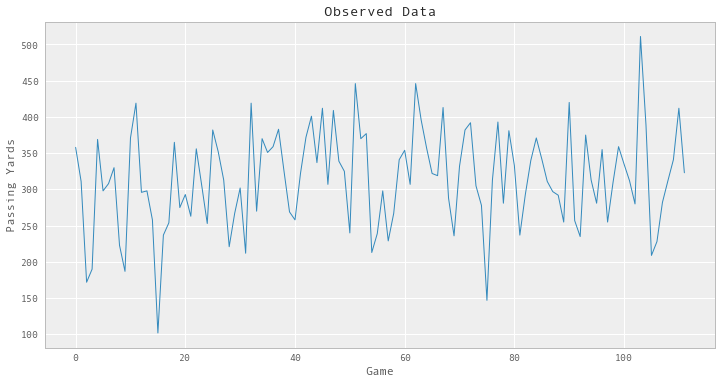
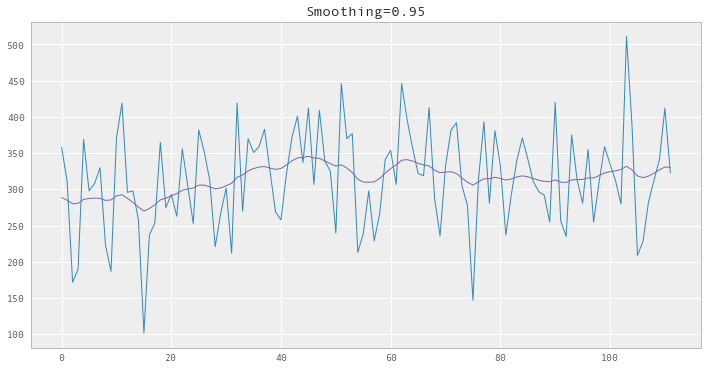

#+SETUPFILE: ~/bin/git/org-html-themes/setup/theme-readtheorg.setup
#+HTML_HEAD: 
* Import modules
#+BEGIN_SRC emacs-lisp :session
(setq python-shell-interpreter "ipython2") ;; make sure we use python 2
#+END_SRC

#+BEGIN_SRC ipython :session :results none
%pylab inline
figsize(12, 6);

import numpy as np
import scipy.stats as stats
import pymc3 as pm
from theano import shared
from pymc3.distributions.timeseries import GaussianRandomWalk
from scipy import optimize
#+END_SRC

* Plot Data
#+BEGIN_SRC ipython :session :file ./img/fig_smoth_0.png :exports both

# passing yards for week
def team_passing_yds(team, season_year, week, season_type='Regular'):
    db = nfldb.connect()
    q = nfldb.Query(db)

    q.game(season_year=season_year, season_type='Regular', week=week, team=team)
    q.play_player(team=team)
    pps = q.as_aggregate()
    return sum(pp.passing_yds for pp in pps)

# passing yards for year
def team_passing_yds_yearly(team, season_year, season_type='Regular'):
    yds = np.array([])
    for week in range(1, 18):
        yds_week = team_passing_yds(team, season_year, week, season_type)
        if yds_week>0: # hack to avoid bye week
            yds = np.append(yds, yds_week)
    return yds

# passing yard data available
def team_passing_yds_all(team, season_type='Regular'):
    yds = np.array([])
    # this database only has data for 2009 to 2016
    for season_year in range(2009, 2016):
        yds = np.append(yds, team_passing_yds_yearly(team, season_year, season_type))
    return yds

yds = team_passing_yds_all('NO')

plot(yds);
xlabel("Game");
ylabel("Passing Yards");
title("Observed Data");
#+END_SRC

#+RESULTS:

* Rolling model

#+BEGIN_SRC ipython :session :file  :exports both :results none
LARGE_NUMBER = 1e5

model = pm.Model()
with model:
    smoothing_param = shared(0.9)
    mu = pm.Normal("mu", sd=LARGE_NUMBER)
    tau = pm.Exponential("tau", 1.0/LARGE_NUMBER)
    z = GaussianRandomWalk("z",
                           mu=mu,
                           tau=tau / (1.0 - smoothing_param),
                           shape=yds.shape)
    obs = pm.Normal("obs",
                    mu=z,
                    tau=tau / smoothing_param,
                    observed=yds)
#+END_SRC

#+BEGIN_SRC ipython :session :file  :exports both :results none
def infer_z(smoothing):
    with model:
        smoothing_param.set_value(smoothing)
        res = pm.find_MAP(vars=[z], fmin=optimize.fmin_l_bfgs_b)
        return res['z']
#+END_SRC

#+BEGIN_SRC ipython :session :file ./img/fig_smooth_1.png :exports both
smoothing = .95
z_val = infer_z(smoothing)

plot(yds);
plot(z_val);
title("Smoothing={}".format(smoothing));
#+END_SRC

#+RESULTS:

