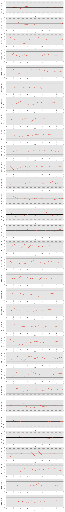

#+SETUPFILE: ~/bin/git/org-minimal-html-theme/setup/theme-minimal.setup
* Front matter
** Make sure we're using python3
#+BEGIN_SRC emacs-lisp :session
(setq python-shell-interpreter "ipython3")
#+END_SRC

#+RESULTS:
: ipython3

** Imports
#+BEGIN_SRC ipython :session :exports both :results none
  import matplotlib.pyplot as plt
  plt.style.use('ggplot')
  %matplotlib inline
  %config InlineBackend.figure_format = 'png'
  import numpy as np
  import pandas as pd
  from pandas.tools.plotting import autocorrelation_plot
  from IPython.core.debugger import Tracer
#+END_SRC

** Data
#+BEGIN_SRC ipython :session :results none
  df = pd.read_csv('out.csv', index_col=0)
  num_teams = len(df.i_home.drop_duplicates())
  teams = pd.read_csv('teams.csv', index_col=0)
#+END_SRC

* Auto-correlation 
** for each team
#+BEGIN_SRC ipython :session :file ./img/autoplot.png :exports both
    # Initialize figure
    fig, axes = plt.subplots(nrows=32, figsize=(8, 64))
    fig.tight_layout()

    for i in range(0,32):
	# Identify matching games
	home_match = df['home_team'] == teams['team'][i]
	away_match = df['away_team'] == teams['team'][i]

	# Create data frame with matching data
	g = df[home_match].home_yds
	g = g.append(df[away_match].away_yds)

	# Sort by index
	g.sort_index(inplace=True)
	g.reset_index(drop=True, inplace=True)

	# Plot 
	autocorrelation_plot(g,ax=axes[i])

#+END_SRC

#+RESULTS:

* Conclusion
Auto-correlation doesn't seem to be significant, which is a bit unexpected. 
