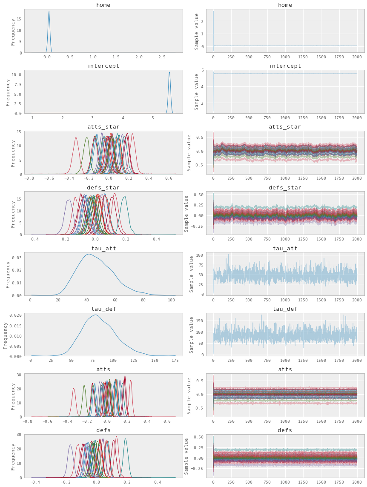
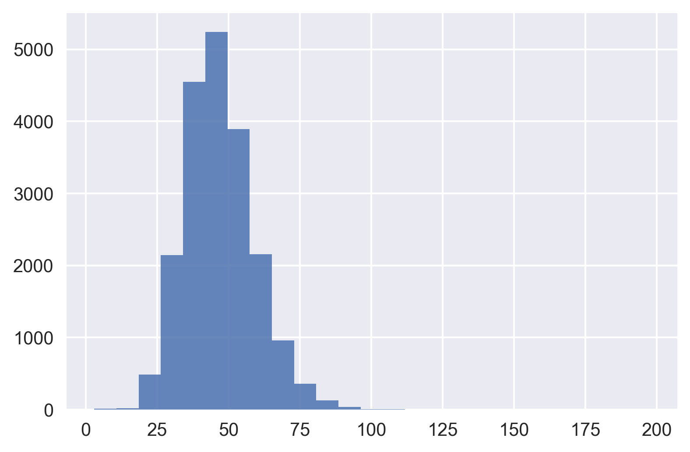
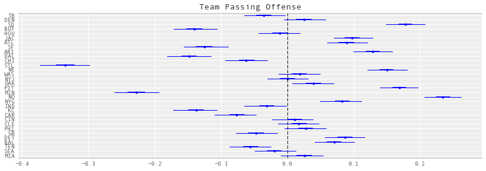
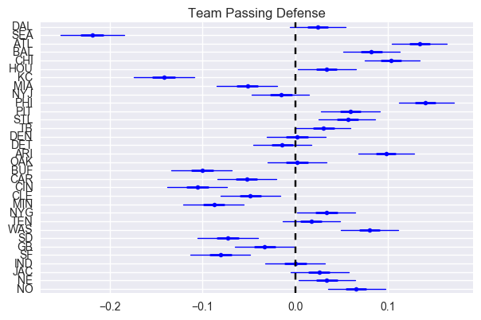
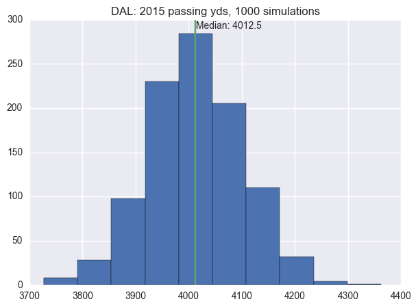
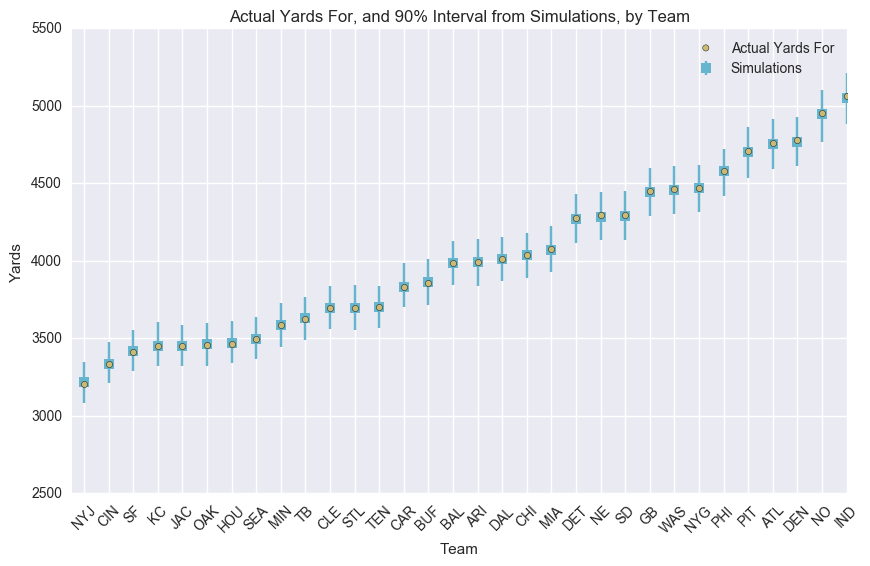

#+SETUPFILE: ~/bin/git/org-html-themes/setup/theme-readtheorg.setup
#+HTML_HEAD: 
* Import modules
#+BEGIN_SRC emacs-lisp :session
(setq python-shell-interpreter "ipython2") ;; make sure we use python 2
#+END_SRC

#+RESULTS:
: ipython2

#+RESULTS:

#+BEGIN_SRC ipython :session :exports both :results none
  import sys
  import math
  import nfldb
  import matplotlib.pyplot as plt
  from pylab import rcParams
  %matplotlib inline
  %config InlineBackend.figure_format = 'png'
  import seaborn as sns
  import numpy as np
  import pandas as pd
  import theano.tensor as tt
  import pymc3 as pm
  from IPython.core.debugger import Tracer

  sys.setrecursionlimit(4000)
  sns.set(style="darkgrid", palette="muted")
  pd.set_option('display.mpl_style', 'default')
  plt.rcParams['figure.figsize'] = 12, 4
  np.random.seed(0)
#+END_SRC

* The data
** nfldb
Load database with passing yards for the 2015 regular season with nfldb

#+BEGIN_SRC ipython :session :results none
  df = pd.read_csv('out.csv', index_col=0)
  num_teams = len(df.i_home.drop_duplicates())
  teams = pd.read_csv('teams.csv', index_col=0)
#+END_SRC

#+BEGIN_SRC ipython :session :exports both
  g = df.groupby('away_team')
  away_yds = g.away_yds.sum() # log of mean scores when away
  g = df.groupby('home_team')
  home_yds = g.home_yds.sum() # log of mean scores when away
  tot_yds = away_yds + home_yds
  tot_yds.sort_values(inplace=True)
  tot_yds
#+END_SRC

#+RESULTS:
#+begin_example
away_team
STL    2931
MIN    3246
KC     3493
BUF    3600
SF     3646
DAL    3677
GB     3825
CHI    3843
CAR    3873
TEN    3893
IND    3928
TB     4044
SEA    4059
HOU    4079
CIN    4104
OAK    4129
CLE    4156
NYJ    4170
DEN    4216
MIA    4233
WAS    4294
PHI    4341
JAC    4428
BAL    4462
DET    4463
NYG    4515
ATL    4602
ARI    4775
NE     4812
PIT    4817
SD     4856
NO     5213
dtype: int64
#+end_example

* Modeling
** Initial parameter values
#+BEGIN_SRC ipython :session :exports both :results none
  g = df.groupby('i_away')
  att_starting_points = np.log(g.away_yds.mean()) # log of mean scores when away
  g = df.groupby('i_home')
  def_starting_points = -np.log(g.away_yds.mean())
#+END_SRC

** Priors
#+BEGIN_SRC ipython :session :exports both :results none
  from pymc3.distributions.timeseries import GaussianRandomWalk
  model = pm.Model()
  with model:
      # global model parameters
      home       = pm.Normal('home',      0, tau=.0001)
      tau_att    = pm.Gamma('tau_att',   .1, .1)
      tau_def    = pm.Gamma('tau_def',   .1, .1)
      intercept  = pm.Normal('intercept', 0, tau=.0001)

      #team-specific parameters
      # atts_star  = pm.Normal('atts_star',
      #                         mu    = 0,
      #                         tau   = tau_att,
      #                         shape = num_teams)
      # defs_star  = pm.Normal('defs_star',
      #                         mu    = 0,
      #                         tau   = tau_def,
      #                         shape = num_teams)

      atts_star = pm.GaussianRandomWalk('atts_star',
					tau = tau_att,
					shape = num_teams)

      defs_star = pm.GaussianRandomWalk('defs_star',
					tau = tau_def,
					shape = num_teams)

      atts       = pm.Deterministic('atts', atts_star - tt.mean(atts_star))
      defs       = pm.Deterministic('defs', defs_star - tt.mean(defs_star))
      home_theta = tt.exp(intercept + home + atts[df.i_home.values] + defs[df.i_away.values])
      away_theta = tt.exp(intercept + atts[df.i_away.values] + defs[df.i_home.values])

#+END_SRC

** Update with observed data
#+BEGIN_SRC ipython :session  :exports both :results none
  import copy
  m = copy.copy(model)
  with m:
	# likelihood of observed data
	home_yds = pm.Poisson('home_yds',
                              mu=home_theta,
                              observed=df.home_yds.values)

	away_yds = pm.Poisson('away_yds',
                              mu=away_theta,
                              observed=df.away_yds.values)
#+END_SRC

** Sample
#+BEGIN_SRC ipython :session :file ./img/fig0.png :exports both
  with m:
      start = pm.find_MAP()
      step = pm.NUTS(state=start)
      trace = pm.sample(2000,step,init=start)
  pm.traceplot(trace)
#+END_SRC

#+RESULTS:

* Results
** Convergence
#+BEGIN_SRC ipython :session :file ./img/fig1.png :exports both
plt.hist(trace['tau_att'], histtype='stepfilled', bins=25, alpha=0.85)
#+END_SRC

#+RESULTS:

** Confidence Intervals
*** Attack strength
#+BEGIN_SRC ipython :session :file ./img/fig2.png :exports both
pm.forestplot(trace, varnames=['atts'], ylabels=teams['team'], main="Team Passing Offense")
#+END_SRC

#+RESULTS:

*** Defense strength
#+BEGIN_SRC ipython :session :file ./img/fig3.png :exports both
pm.forestplot(trace, varnames=['defs'], ylabels=teams['team'], main="Team Passing Defense")
#+END_SRC

#+RESULTS:

* Simulation
** Simulation functions
#+BEGIN_SRC ipython :session :exports both :results none
    def simulate_season():
        """
        Simulate a season once, using one random draw from the mcmc chain.
        """
        num_samples = trace['atts'].shape[0]
        draw = np.random.randint(0, num_samples)
        atts_draw = pd.DataFrame({'att': trace['atts'][draw, :],})
        defs_draw = pd.DataFrame({'def': trace['defs'][draw, :],})
        home_draw = trace['home'][draw]
        intercept_draw = trace['intercept'][draw]
        season = df.copy()
        season = pd.merge(season, atts_draw, left_on='i_home', right_index=True)
        season = pd.merge(season, defs_draw, left_on='i_home', right_index=True)
        season = season.rename(columns = {'att': 'att_home', 'def': 'def_home'})
        season = pd.merge(season, atts_draw, left_on='i_away', right_index=True)
        season = pd.merge(season, defs_draw, left_on='i_away', right_index=True)
        season = season.rename(columns = {'att': 'att_away', 'def': 'def_away'})
        season['home'] = home_draw
        season['intercept'] = intercept_draw
        season['home_theta'] = season.apply(lambda x: math.exp(x['intercept'] +
                                                          x['home'] +
                                                          x['att_home'] +
                                                          x['def_away']), axis=1)

        season['away_theta'] = season.apply(lambda x: math.exp(x['intercept'] +
                                                          x['att_away'] +
                                                          x['def_home']), axis=1)

        season['home_yds'] = season.apply(lambda x: np.random.poisson(x['home_theta']), axis=1)

        season['away_yds'] = season.apply(lambda x: np.random.poisson(x['away_theta']), axis=1)
        return season

    def create_season_table(season):
        '''
        use dataframe output of simulate_season to creat summary season table
        '''
        g = season.groupby('i_home')
        home = pd.DataFrame({'home_yds': g.home_yds.sum(),
                             'home_yds_against': g.away_yds.sum(),
                             })
        g = season.groupby('i_away')
        away = pd.DataFrame({'away_yds': g.away_yds.sum(),
                             'away_yds_against': g.home_yds.sum(),
                             })
        df = home.join(away)
        df['yf'] = df.home_yds + df.away_yds
        df['ya'] = df.home_yds_against + df.away_yds_against
        df = pd.merge(teams, df, left_on='i', right_index=True)
        return df

    def simulate_seasons(n):
        dfs = []
        for i in range(n):
            s = simulate_season()
            t = create_season_table(s)
            t['iteration'] = i
            dfs.append(t)
        return pd.concat(dfs, ignore_index=True)
#+END_SRC

** Execute simulations
#+BEGIN_SRC ipython :session :results none
simuls = simulate_seasons(1000)
#+END_SRC

** View
*** Season passing yards for a single team
#+BEGIN_SRC ipython :session :file ./img/fig4.png :exports both
  team_name = 'DAL'
  ax = simuls.yf[simuls.team == team_name].hist(figsize=(7,5))
  median = simuls.yf[simuls.team == team_name].median()
  ax.set_title(team_name + ': 2015 passing yds, 1000 simulations')
  ax.plot([median, median], ax.get_ylim())
  plt.annotate('Median: %s' % median, xy=(median + 1, ax.get_ylim()[1]-10))
#+END_SRC

#+RESULTS:

*** Comparison for all teams

#+BEGIN_SRC ipython :session :file ./img/fig5.png :exports both
  df_observed = create_season_table(df)
  g = simuls.groupby('team')
  season_hdis = pd.DataFrame({'yds_for_lower': g.yf.quantile(.05),
                              'yds_for_median': g.yf.median(),
                              'yds_for_upper': g.yf.quantile(.95),
                              'yds_against_lower': g.ya.quantile(.05),
                              'yds_against_upper': g.ya.quantile(.95),
  })

  season_hdis = pd.merge(season_hdis, df_observed, left_index=True, right_on='team')
  column_order = ['team', 'yds_for_lower', 'yf', 'yds_for_median', 'yds_for_upper',
                  'yds_against_lower', 'ya', 'yds_against_upper',]
  season_hdis = season_hdis[column_order]
  season_hdis['relative_yds_upper'] = season_hdis.yds_for_upper - season_hdis.yds_for_median
  season_hdis['relative_yds_lower'] = season_hdis.yds_for_median - season_hdis.yds_for_lower
  season_hdis = season_hdis.sort_index(by='yf')
  season_hdis = season_hdis.reset_index()
  season_hdis['x'] = season_hdis.index + .5
  season_hdis

  fig, axs = plt.subplots(figsize=(10,6))
  axs.scatter(season_hdis.x, season_hdis.yf, c=sns.palettes.color_palette()[4], zorder = 10, label='Actual Yards For')
  axs.errorbar(season_hdis.x, season_hdis.yds_for_median,
                  yerr=(season_hdis[['relative_yds_lower', 'relative_yds_upper']].values).T,
                  fmt='s', c=sns.palettes.color_palette()[5], label='Simulations')
  axs.set_title('Actual Yards For, and 90% Interval from Simulations, by Team')
  axs.set_xlabel('Team')
  axs.set_ylabel('Yards')
  axs.set_xlim(0, 20)
  axs.legend()
  _= axs.set_xticks(season_hdis.index + .5)
  _= axs.set_xticklabels(season_hdis['team'].values, rotation=45)
#+END_SRC

#+RESULTS:

#+RESULTS:
